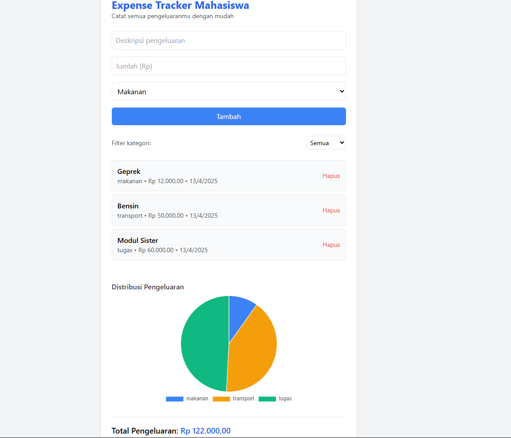

#  Expense Tracker Mahasiswa

Aplikasi berbasis web untuk mencatat dan memantau pengeluaran harian mahasiswa secara praktis, interaktif, dan modern. Seluruh data disimpan di localStorage, sehingga tetap tersimpan meskipun browser ditutup.

---

##  Fitur Aplikasi

- Menambahkan pengeluaran (deskripsi, jumlah, kategori)
- Menampilkan daftar pengeluaran
- Menghapus pengeluaran
- Filter pengeluaran berdasarkan kategori
- Menghitung total pengeluaran secara otomatis
- Menampilkan grafik distribusi pengeluaran (Pie Chart)
- Desain UI responsif dan modern dengan TailwindCSS
- Penyimpanan data secara lokal (localStorage)

---

##  Fitur ES6+ yang Diimplementasikan
 
- Deklarasi variabel menggunakan `let` dan `const`
- Arrow functions (`=>`) untuk callback dan event listener
- Template literals untuk menyisipkan variabel ke HTML
- Modularisasi kode dengan `import` dan `export`
- Ternary operator untuk render kondisi (data kosong)
- Fungsi modular & pengelolaan data dinamis
- (Optional) Dapat dikembangkan menggunakan class dan spread operator

---

##  Struktur Folder

 - Cara Menjalankan
 - Buka file index.html di browser
 - Tambahkan pengeluaran melalui form
 - Gunakan filter untuk menampilkan kategori tertentu
 - Lihat total dan grafik pengeluaran di bawah

 ---

## Teknologi yang Digunakan
 - HTML, CSS (Tailwind via CDN)
 - JavaScript (ES6+)
 - Chart.js untuk grafik pie

 ---

## Catatan Tambahan
 - Tidak membutuhkan backend/server
 - Semua data disimpan di localStorage
 - Bisa dikembangkan dengan fitur tambahan seperti: export CSV, dark mode, atau class-based structure

 ---

## Berikut adalah Screenshot aplikasi yang sudah jadi

 